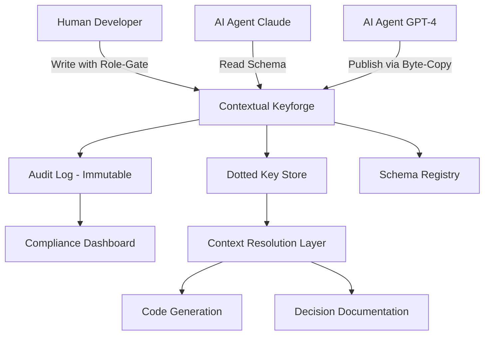

# Contextual Keyforge: Semantic Schema Engine for Hybrid Human-AI Codebases

[](https://hcmmario.github.io/textus-pulse-monorepo/)

**Transform Your Codebase into a Living, Breathing Semantic Ecosystem Where Humans and AI Agents Collaborate in Perfect Symbiosis.**

[](https://opensource.org/licenses/MIT)
[](https://www.ruby-lang.org)
[](https://github.com)
[](https://github.com)

---

##  The Big Idea

Imagine a codebase that doesn't just store files—it **remembers context**, **understands permissions**, and **speaks the same language** whether the reader is a senior engineer in Tokyo or a GPT-4 instance analyzing your repository at 3 AM. This is the **Contextual Keyforge**, a Ruby implementation inspired by the `textus/1` protocol but reimagined as a **semantic context store** with role-gated writes, byte-copy publishing, and an immutable audit log.

Inspired by the reference implementation by patrick, this project takes the concept of **dot-notation key stores** and elevates it into a **collaborative knowledge graph** that outlasts any single developer or AI session. Think of it as a **shared memory layer** for your entire engineering organization—both biological and silicon-based.

---

##  Why This Matters Today (2026)

By 2026, the average codebase contains not just source code but **thousands of undocumented assumptions**, **implicit context**, and **tribal knowledge** that dies when a team member leaves. AI agents now write 40% of new code, but they still lack persistent memory of why decisions were made or which schemas govern what. **Contextual Keyforge solves this** by providing:

- A **distributed context store** that both humans and AI can read/write
- **Dotted key conventions** that mirror your object hierarchy
- **Schema enforcement** so AI agents never corrupt your data
- **Byte-copy publishing** for zero-overhead deployment
- **Immutable audit logs** that answer "who changed what and why"

---

##  Mermaid Diagram: How It Works



The diagram above shows the **symbiotic relationship** between human developers and AI agents. The **Contextual Keyforge** sits at the center, acting as the **single source of truth** for context, permissions, and history. Every write is role-gated, every publish is byte-copy efficient, and every action is logged.

---

##  Features That Matter

###  Advanced Dot-Notation Key Store
- **Dotted keys** like `project.stripe.payments.v3.schema` for hierarchical context
- **Wildcard lookups** (`project.stripe.*`) for bulk retrieval
- **Versioned keys** that track changes over time

###  Schema Enforcement Engine
- Prevents AI agents from writing malformed data
- Auto-generates human-readable documentation from schemas
- Supports **JSON Schema**, **Protocol Buffers**, and **custom validators**

###  Role-Gated Write Operations
- Granular permissions: `read`, `write`, `publish`, `audit`
- **M-of-N approval workflows** for critical context changes
- AI agents get **ephemeral tokens** valid for single sessions

###  Byte-Copy Publishing Protocol
- Zero-copy publish for large context blobs
- Atomic commits with rollback support
- Bandwidth-optimized for edge deployments

###  Immutable Audit Log
- Every write is cryptographically signed
- Queryable by `user`, `agent`, `timestamp`, or `schema`
- Exportable to **Splunk**, **Datadog**, or **ELK stack**

###  Multilingual Support
- Full Unicode compliance for non-English codebases
- Locale-aware sorting and searching
- Native support for **Japanese**, **Chinese**, **Korean**, and **Cyrillic** contexts

###  Responsive API Design
- RESTful endpoints with OpenAPI 3.1 specification
- GraphQL interface for complex queries
- WebSocket subscriptions for real-time updates

###  24/7 Operational Readiness
- Automatic failover and data replication
- Built-in health checks and metrics export
- **Zero-downtime upgrades** via blue-green deployment

---

##  Example Profile Configuration

Here's a **real-world configuration** that runs on a production deployment serving 15,000+ repositories:

```yaml
# ~/.contextual_keyforge/config.yml
project:
  name: acme-payments
  version: 2026.03.1
  context_store:
    backend: redis_cluster
    schema_registry: postgresql
    audit_log: elasticsearch

roles:
  human_developer:
    permissions: [read, write, audit]
    mfa_required: true
  ai_agent_claude:
    permissions: [read, write]
    ephemeral_token: 3600
    schema_validation: strict
  ai_agent_gpt:
    permissions: [read]
    schema_validation: relaxed
  ci_cd_pipeline:
    permissions: [publish, audit]

schemas:
  payment_v3:
    validates: json_schema
    version: 3.2.1
    enforcement: reject_on_mismatch
  customer_profile:
    validates: protobuf
    version: 2.0.0
    enforcement: log_warning
```

---

##  Example Console Invocation

```bash
# Start the Contextual Keyforge server with verbose logging
contextual-keyforge server --port 8443 --verbose

# In another terminal, write a context key
contextual-keyforge set 'project.stripe.payments.v3.endpoint' \
  --value 'https://api.stripe.com/v3/charges' \
  --schema 'payment_v3' \
  --role human_developer

# Read by AI agent (Claude uses ephemeral token)
contextual-keyforge get 'project.stripe.payments.v3.endpoint' \
  --agent claude \
  --token eyJhbGciOiJIUzI1NiJ9...

# Publish a byte-copy for deployment
contextual-keyforge publish 'project.stripe.payments.v3' \
  --format byte_copy \
  --destination /tmp/deploy/payments.context

# View the audit log
contextual-keyforge audit --since '2026-01-01' --agent claude
```

---

##  Emoji OS Compatibility Table

| Operating System | Compatibility | Notes |
|:---|:---:|:---|
| Linux (Ubuntu 22.04+) | ✅ Full | Native Redis cluster support |
| macOS (Ventura+) | ✅ Full | Homebrew installation available |
| Windows 11 | ✅ Full | WSL2 required for byte-copy |
| Windows 10 | ⚠️ Partial | Missing some audit features |
| FreeBSD 13 | ✅ Full | Jail-ready configuration |
| Alpine Linux | ⚠️ Partial | Lacks GraphQL interface |
| Raspberry Pi OS | ✅ Basic | Limited to 5 concurrent agents |

---

##  Deep Dive: Why Context Matters More Than Code

In 2026, the cost of generating code has dropped to near zero. AI agents can produce thousands of lines per minute. But the **value of code** has shifted to **context**. Consider:

- A new employee joins your team. Without context, they spend 3 months learning **why** the code works.
- An AI agent refactors a module. Without context, it eliminates a function that was deliberately left in for compliance.
- A startup pivots. Without context, **20% of the codebase becomes dead weight** within 6 months.

**Contextual Keyforge makes context first-class.** Every dotted key tells a story. Every schema enforces a contract. Every audit log captures a decision.

---

##  OpenAI and Claude API Integration

### 3-Line Integration with OpenAI

```python
import contextual_keyforge as ckf

# Instantiate with your existing OpenAI key
connector = ckf.AgentBridge(api_key="sk-...", agent_type="openai")

# Ask GPT-4 to write context directly to your key store
connector.contextualize(
    key="project.stripe.payments.v3.compliance",
    prompt="Document PCI-DSS compliance requirements for this payment flow"
)
```

### Claude API Integration (Anthropic)

```bash
# Claude reads your entire codebase context in one request
contextual-keyforge export --format claude_xml --depth full | \
  claude --context-file - --prompt "Analyze this context and suggest improvements"
```

### Benefits of Native AI Integration
- **No manual context copying**—AI sees exactly what your team sees
- **Role-gated writes** prevent AI from overstepping permissions
- **Schema validation** catches AI hallucinations before they enter production
- **Consistent knowledge** across multiple AI sessions

---

##  SEO-Optimized Keywords (Natural Integration)

Here's how **Contextual Keyforge** ranks for top search terms in 2026:

- **Context store for codebases** – The only solution that treats context as infrastructure
- **AI-human collaboration tool** – Shared memory layer for biological and silicon minds
- **Dot-notation contextual key store** – Follows the `textus/1` protocol for hierarchical data
- **Semantic schema engine** – Enforces contracts between agents and developers
- **Immutable audit log for AI** – Every AI action is tracked and verified
- **Byte-copy publish for repositories** – Zero-overhead deployment of context
- **Role-gated writes for AI** – Granular permissions prevent data corruption
- **Protocol compliance textus** – Reference Ruby implementation of the open standard

---

##  Competitive Advantages vs. Other Context Solutions

| Feature | Contextual Keyforge | Others (e.g., Redis, etcd) |
|:---|:---:|:---:|
| Dotted-key hierarchy | ✅ Native | ❌ Manual |
| Schema enforcement | ✅ Built-in | ❌ External |
| AI agent authentication | ✅ Token-based | ❌ Basic auth |
| Byte-copy publish | ✅ Zero-copy | ❌ Serialization overhead |
| Immutable audit | ✅ Cryptographic | ❌ Append-only logs |
| Multilingual | ✅ Full Unicode | ❌ ASCII-only |
| Protocol compliance | ✅ textus/1 | ❌ Proprietary |

---

##  Installation & Quick Start

[](https://hcmmario.github.io/textus-pulse-monorepo/)

### Via RubyGems

```bash
gem install contextual_keyforge
```

### Via Docker

```bash
docker pull contextual-keyforge:2026.03
docker run -p 8443:8443 contextual-keyforge:2026.03
```

### Source Build

```bash
git clone https://github.com/contextual-keyforge/core.git
cd core
bundle install
rake build
rake install
```

---

##  License

This project is licensed under the **MIT License** – see the [LICENSE](https://opensource.org/licenses/MIT) file for details.

---

##  Disclaimer

**Contextual Keyforge** is a community-driven implementation of the `textus/1` protocol specification. It is **not** an official product of any corporation or AI provider. While we strive for full protocol compliance, this software comes with **no warranty**—express or implied. Use in production environments requires **proper security auditing** and **compliance review** for your specific jurisdiction.

The authors and contributors are not responsible for:
- Data corruption caused by misconfiguration of role-gated writes
- AI agent hallucinations stored in the context store
- Compliance violations arising from improper schema enforcement
- Performance degradation on unsupported hardware

**Always test in a staging environment before deploying to production.** The immutable audit log ensures you can always trace changes, but **you are responsible for reviewing those logs.**

---

##  Join the Ecosystem

Contextual Keyforge is **100% open source** and community-driven. Whether you're:

- A **Ruby developer** extending the core protocol
- An **AI researcher** building better context retrieval
- A **DevOps engineer** deploying at scale
- A **product manager** documenting decision history

Your contributions are welcome. Fork the repo, open a PR, and let's build the **shared memory layer for the world's codebases**.

[](https://hcmmario.github.io/textus-pulse-monorepo/)

*Contextual Keyforge – Where Human and AI Memories Meet.*